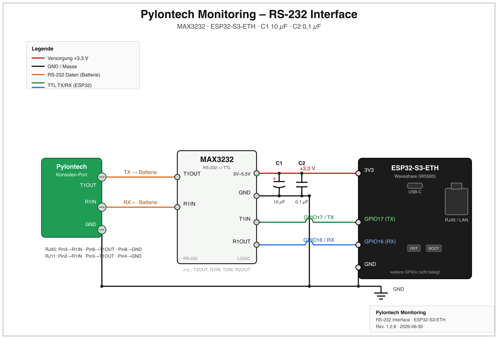

# Pylontech Battery Monitoring

> **⚠️ HAFTUNGSAUSSCHLUSS: Ich übernehme keinerlei Verantwortung für etwaige Schäden. Nutzung auf eigene Gefahr.**

ESP32-S3-basierte Firmware zur Überwachung von Pylontech-Batterien (US2000B, US2000C, US3000C, US5000) über WLAN oder Ethernet.  
Forked von [irekzielinski/Pylontech-Battery-Monitoring](https://github.com/irekzielinski/Pylontech-Battery-Monitoring), [@hidaba](https://github.com/hidaba) und [@HeldvomForst](https://github.com/HeldvomForst/PylontechMonitoring_ESP32) grundlegend für ESP32-S3 überarbeitet.

---

## Inhaltsverzeichnis

1. [Features](#features)
2. [Hardware](#hardware)
3. [Verkabelung](#verkabelung)
4. [Erstinstallation](#erstinstallation)
5. [Web-Interface](#web-interface)
6. [MQTT](#mqtt)
7. [OTA-Update](#ota-update)
8. [Boot-Taster Funktionen](#boot-taster-funktionen)
9. [Konfigurationsparameter](#konfigurationsparameter)
10. [Architektur](#architektur)
11. [Changelog](#changelog)

---

## Features

- **Dual-Core-Architektur** – UART-Kommunikation auf Core 0, Web/MQTT/WiFi auf Core 1
- **Web-Interface** – Dashboard, Zellspannungen, Statistiken, Health-Übersicht, Konsole, Log
- **MQTT-Support** – Publisht Batteriestatus an beliebigen Broker; Home-Assistant Autodiscovery
- **OTA-Firmware-Update** – direkt über das Web-Interface (keine USB-Verbindung nötig)
- **Ethernet-Support** – W5500 SPI (z. B. Waveshare ESP32-S3-ETH)
- **DHCP oder statische IP** – für WiFi und Ethernet unabhängig konfigurierbar
- **Display-Unterstützung** – ST7735 TFT (optional)
- **NTP-Zeitsynchronisation** – mit konfigurierbarer Zeitzone und DST
- **Health-Monitoring** – Zellspannungsdifferenz-Überwachung mit Warn-/Fehlerschwellen
- **Einstellungen-Backup/Restore** – JSON-Export und -Import über Web-Interface
- **Factory Reset** – per Taster oder Web-Interface
- **Robuste INFO/STAT/BAT-Settings** – NVS-Cache + Last-Good-Fallback gegen leere Seiten nach Navigation
- **Stabile Scheduler-Queue** – Mutex, Deduplizierung und Queue-Limit zur Vermeidung von Refresh-Stuermen

---

## Hardware

| Bauteil | Beschreibung |
|---|---|
| Waveshare ESP32-S3 PoE ETH| Mikrocontroller (16 MB Flash (Minimum 4MB Flash), 8 MB PSRAM) |
| MAX3232 Transceiver | RS-232 ↔ UART-Pegelwandler |
| Kondensator C1 | 10 µF (empfohlen, stabilisiert Stromversorgung) |
| Kondensator C2 | 0,1 µF (empfohlen) |
| Kabel US2000B | RJ11 (4-adrig!) |
| Kabel US2000C / US3000C / US5000 | RJ45 |

---

## Verkabelung

### Allgemein (MAX3232 ↔ ESP32-S3)

```
MAX3232 T1IN  → ESP32 TX  (GPIO 17)
MAX3232 R1OUT → ESP32 RX  (GPIO 16)
MAX3232 GND   → GND
MAX3232 VCC   → 3.3 V
```

### Pylontech US2000B – RJ11

```
RJ11 Pin 2 → MAX3232 R1IN
RJ11 Pin 3 → MAX3232 T1OUT
RJ11 Pin 4 → GND
```

### Pylontech US2000C / US3000C / US5000 – RJ45

```
RJ45 Pin 3 (weiß-grün) → MAX3232 R1IN
RJ45 Pin 6 (grün)      → MAX3232 T1OUT
RJ45 Pin 8 (braun)     → GND
```

> Bei mehreren Batterien immer am **Master** anschließen.



---

## Erstinstallation

### 1. Firmware kompilieren & flashen (einmalig per USB)

Voraussetzung: [arduino-cli](https://arduino.github.io/arduino-cli/) installiert, ESP32-Core installiert.

```bash
# Partitionstabelle bereitstellen
cp partitions/pylontech_ota_spiffs.csv partitions.csv

# Kompilieren
arduino-cli compile \
  --fqbn "esp32:esp32:esp32s3:PartitionScheme=custom,FlashSize=4M" \
  --libraries libraries/ \
  --output-dir build/ .

# Flashen
arduino-cli upload \
  --fqbn "esp32:esp32:esp32s3:PartitionScheme=custom,FlashSize=4M" \
  --port /dev/tty.usbmodem<XXXX> \
  --input-dir build/ .

# Alternativ: Flashen mit espserial-Skript (inkl. Vollmodus)
# Standard: nur App (schnelles Update)
./espserial.sh --port /dev/tty.usbmodem<XXXX>

# Vollflash: Bootloader + Partitionstabelle + Boot-App + Firmware
./espserial.sh --port /dev/tty.usbmodem<XXXX> --full

# Optional mit vorherigem Komplett-Loeschen
./espserial.sh --port /dev/tty.usbmodem<XXXX> --full --erase

# Komfort: Vollflash inkl. automatischer SPIFFS-Erzeugung aus data/
./espserial.sh --port /dev/tty.usbmodem<XXXX> --full-with-spiffs

# OTA-Paket aus aktueller App-Binary erzeugen (kein USB-Flash)
./espserial.sh --ota-package

# OTA-Paket erzeugen und direkt per otaup an ESP senden
./espserial.sh --ota-upload 192.168.8.64
```

Hinweis: Ein SPIFFS-Image kann optional im Vollmodus geflasht werden.

```bash
# SPIFFS-Image aus data/ erzeugen (Groesse aus partitions.csv: 0x9F0000)
"$HOME"/Library/Arduino15/packages/esp32/tools/mkspiffs/0.2.3/mkspiffs \
  -c data -b 4096 -p 256 -s 0x9F0000 build/spiffs.bin

# Vollflash inkl. SPIFFS
./espserial.sh --port /dev/tty.usbmodem<XXXX> --full --spiffs-image build/spiffs.bin
```

### 2. Web-Dateien hochladen

1. ESP32 startet als WLAN-Hotspot `pylontech-XXXX`
2. Im Browser `http://192.168.4.1/filemanager` öffnen
3. Alle Dateien aus dem Ordner `data/` hochladen
4. Browser auf `http://192.168.4.1` – Seite wird angezeigt

### 3. WLAN einrichten

1. Seite `Verbindung` → **Scan** → Netz auswählen → Passwort eingeben → Speichern
2. Ca. 30 Sekunden warten – der AP deaktiviert sich automatisch
3. Die neue IP-Adresse wird nach dem Neuverbinden im Dashboard angezeigt

> Alle Seiten sind spätestens 60 Sekunden nach dem Boot erreichbar.

---

## Web-Interface

| URL | Beschreibung |
|---|---|
| `/` | Dashboard (SOC, Spannung, Strom, Temperatur) |
| `/celldata` | Zellspannungen aller Module |
| `/health` | Health-Status (Zellspannungsdifferenzen) |
| `/statistic` | Statistik-Daten |
| `/log` | System-Log |
| `/console` | Direktkonsole zur Batterie |
| `/connect` | WLAN-, MQTT-, NTP-, IP-Einstellungen |
| `/service` | OTA-Update, Neustart, Backup/Restore, Factory Reset |
| `/filemanager` | SPIFFS Dateimanager |

---

## MQTT

### Verbindung konfigurieren

Im Web-Interface unter `Verbindung → MQTT Settings`:

| Parameter | Standard |
|---|---|
| Server | `192.168.8.4` |
| Port | `1883` |
| Prefix | `Pylontech` |
| Stack-Topic | `Stack` |

### Topics

```
Pylontech/Stack/<Feld>          – Stack-Gesamtwerte (SOC, Strom, Spannung …)
Pylontech/pwr/<Modul>/<Feld>   – Einzelmodule (PWR-Kommando)
Pylontech/bat/<Modul>/Cell<N>  – Zellspannungen (BAT-Kommando)
Pylontech/stat/<Modul>/<Feld>  – Statistik (STAT-Kommando)
Pylontech/info/<Modul>/<Feld>  – INFO-Felder (z. B. Barcode, Softversion)
```

### Home Assistant Autodiscovery

- **MQTT** (Checkbox) = Wert wird publiziert
- **Send** (Checkbox) = Autodiscovery-Payload für Home Assistant wird gesendet

---

## OTA-Update

> Funktioniert nur wenn die Partitionstabelle korrekt geflasht wurde (Erstinstallation per USB erforderlich).

1. `http://<ESP-IP>/service` öffnen
2. Datei `build/PylontechMonitoring.ino.bin` auswählen
   _(nicht `merged.bin`, nicht `bootloader.bin`)_
3. **Flashen** klicken – Fortschrittsbalken erscheint
4. ESP startet automatisch neu

**Dateinamen-Anforderung:** Die `.bin`-Datei muss das Wort `Pylontech` im Namen enthalten.

### OTA-Datei per Skript vorbereiten

```bash
# Erzeugt build/PylontechMonitoring.ino.bin und build/PylontechMonitoring.ino.bin.sha256
./espserial.sh --ota-package

# Optional direkt senden (nutzt lokal installiertes otaup)
./espserial.sh --ota-upload <ESP-IP>
```

---

## Boot-Taster Funktionen

| Tastendruck | Aktion |
|---|---|
| 1× kurz | WLAN-Accesspoint aktivieren |
| 5× kurz | WLAN-Einstellungen zurücksetzen |
| 15 s lang halten | Factory Reset (alle Einstellungen löschen) |

---

## Konfigurationsparameter

Alle Einstellungen werden im NVS (Non-Volatile Storage) des ESP32 gespeichert und überleben Firmware-Updates.

### System

| Parameter | Standard | Beschreibung |
|---|---|---|
| `deviceName` | `PylontechMonitor` | Anzeigename |
| `hostname` | `pylontech-XXXX` | mDNS-Hostname (aus MAC generiert) |
| `firmwareVersion` | `1.2.6` | Aktuelle Firmware-Version |

### WiFi / Netzwerk

| Parameter | Beschreibung |
|---|---|
| SSID / Passwort | WLAN-Zugangsdaten |
| Statische IP | Optional: IP, Subnetz, Gateway, DNS |
| Ethernet (W5500) | MISO=12, MOSI=11, SCK=13, CS=14, RST=9, INT=10 |

### MQTT

| Parameter | Standard | Beschreibung |
|---|---|---|
| `mqtt.enabled` | `true` | MQTT aktivieren |
| `mqtt.server` | `192.168.8.4` | Broker-Adresse |
| `mqtt.port` | `1883` | Broker-Port |
| `mqtt.prefix` | `Pylontech` | Topic-Präfix |
| `mqtt.mode` | `active` | Sendemodus |

### Batterie-Abfrageintervalle

| Parameter | Standard | Beschreibung |
|---|---|---|
| `intervalPwr` | 60.000 ms | PWR-Abfrage (Spannung, Strom, SOC) |
| `intervalBat` | 300.000 ms | BAT-Abfrage (Zellspannungen) |
| `intervalStat` | 1.800.000 ms | STAT-Abfrage (Statistik) |
| `intervalInfo` | 3.600.000 ms | INFO-Abfrage (Gerateinfos wie Barcode/Version) |

### Health-Schwellwerte

| Parameter | Standard | Beschreibung |
|---|---|---|
| `cellDiffWarn` | 10 mV | Zellspannungsdifferenz Warnung |
| `cellDiffError` | 20 mV | Zellspannungsdifferenz Fehler |

---

## Architektur

```
ESP32-S3 (Dual Core)
│
├── Core 0 – Realtime Task
│   └── UART ↔ Pylontech RS-232
│       └── Frame-Parser (PWR / BAT / STAT / INFO)
│           └── Double-Buffer (pwrA/B, batA/B, statA/B, infoA/B)
│
└── Core 1 – Non-Critical Task
  ├── Scheduler (Kommando-Queue mit Mutex + Deduplizierung)
    ├── MQTT (PubSubClient)
    ├── Webserver (WebServer)
  ├── API-Cache (NVS + Last-Good-Fallback)
    ├── WiFiManager / EthManager
    ├── SystemManager
    └── Display (ST7735, alle 500 ms)
```

### Partitionstabelle (4 MB Flash)

| Name | Typ | Offset | Größe |
|---|---|---|---|
| nvs | data/nvs | 0x9000 | 20 KB |
| otadata | data/ota | 0xE000 | 8 KB |
| app0 (OTA 0) | app | 0x10000 | 1792 KB |
| app1 (OTA 1) | app | 0x1D0000 | 1792 KB |
| spiffs | data/spiffs | 0x390000 | 448 KB |

---

## Changelog

Siehe [CHANGELOG.md](CHANGELOG.md)
